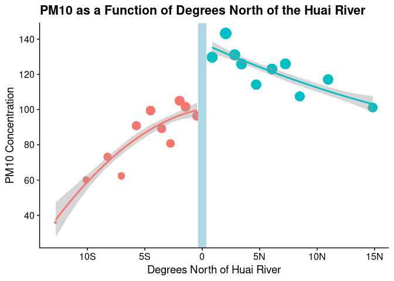
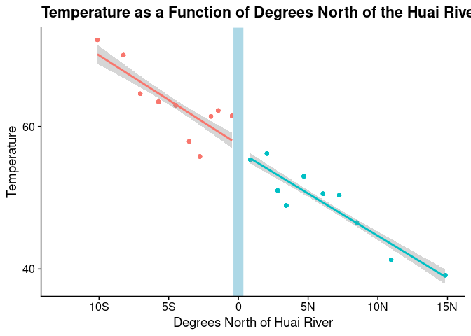
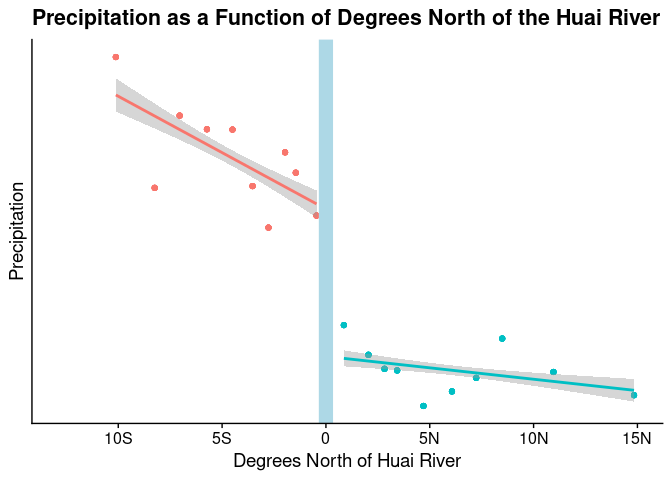
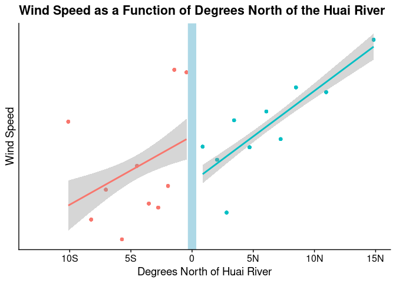
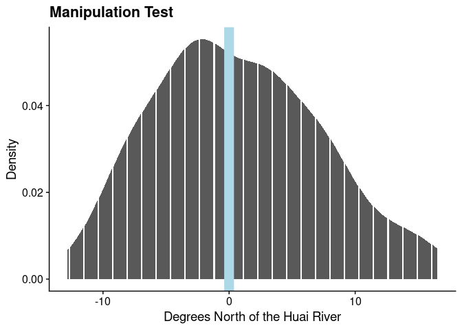
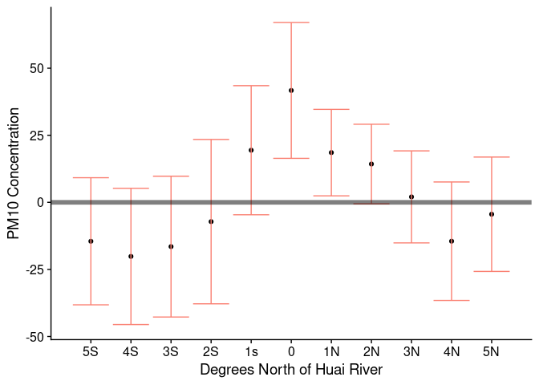

### Question 1

A simple comparison of air pollution across northern and southern cities would not measure the causal effect of the policy because of confounding variables. It is unlikely that people to the north and south of the Huai River would use indoor coal furnaces equally even if they had them. The area to the north of the river is likely colder than the area to the south, so they would have more need for heat. So, the coal furnaces are likely uses more in the north than they would be in the south. A simple comparison of the levels of air pollution would miss this, and so over estimate the effect of the policy. 

The regression discontinuity overcomes this problem because it measures the discontinuous jump right at the river. It is unlikely that the areas separated by just the river have wildly different micro climates, so we would expect (in the absence of the policy) that they would have highly comparable heating needs. So, if there is a discontinuous jump in pollution as the authors found, we can meaningfully attribute that to the policy. The RD design means we are comparing very similar populations in which we would expect to find minimal differences, so when we find a difference, we can interpret it as causal. 

### Question 2

The outcome variable in figure 2 is the PM~10~ concentration in the relevant areas. The assignment variable is the number of degrees north of the Huai River. The outcome measures how polluted the various areas are, while the assignment variable measures whether each city was affected by the policy or not. Cities where the assignment variable is greater than 0 received the treatment because they are north of the river; cites where it is less than 0 are south of the river and so did were not allowed to use indoor coal heating. 

### Question 3

A binned scatter plot is a scatter plot that divides the data into a certain amount of groups, takes the mean of each group and plots the means. This is in contrast to a normal scatter plot where each point on the graph represents one point of data. In the binscatter, each point is the mean of say a 10^th^ of the data. 

It is straightforward to construct a binscatter. First, you choose a number of "bins" to divide your data in to. 10-20 is usually a good number. Next, take the average of each of those 10-20 bins. Now you are left with only 10 data points. Now use your favorite plotting function to make a scatter plot of the new data set, and there you go: a binscatter. 

### Question 4

#### Part a


```r
# Add bins to data

huairiver_df %<>% mutate(bin = cut(dist_huai, breaks = quantile(dist_huai, probs = seq(0,1, by = 0.05), na.rm = T)))

# Make the summarized data frame

huairiver_sum_df = huairiver_df |> 
  group_by(bin) |> 
  summarise(dist = mean(dist_huai, na.rm = T), 
            pm10 = mean(pm10, na.rm = T), 
            north_huai = north_huai)

# Now we can make the binscatter more easily with the collapsed data frame

huairiver_sum_df |> 
  ggplot(aes(x = dist, y = pm10, size = pm10, color = as_factor(north_huai))) +
  geom_point() + 
  geom_smooth(data = filter(huairiver_sum_df, dist <0), method = lm, formula = y~poly(x, 2)) + # Different data so its only for the left side of the graph
  geom_smooth(data = filter(huairiver_sum_df, dist >= 0), method = lm, formula = y~poly(x, 2)) + 
  geom_vline(xintercept = 0, size = 5, color = 'light blue') +
  labs(x = "Degrees North of Huai River",
       y = "PM10 Concentration", 
       title = "PM10 as a Function of Degrees North of the Huai River") + 
  scale_x_continuous(labels = c('15S', "10S", "5S", "0", "5N", "10N", "15N")) +
  scale_y_continuous(breaks = seq(40, 160, by = 20)) + 
  cowplot::theme_cowplot() +
  theme(legend.position = 'none')  
```

<!-- -->

#### Part b

##### Temperature


```r
# Add temp, precipitation, and wind speed to dataframe

huairiver_sum_df = huairiver_df |> 
  group_by(bin) |> 
  summarise(dist = mean(dist_huai, na.rm = T),
            pm10 = mean(pm10, na.rm = T),
            temp = mean(temp, na.rm = T),
            pricip = mean(prcp, na.rm = T),
            wind = mean(wspd, na.rm =T),
            north_huai = north_huai)

# Now we can make the binscatter more easily with the collapsed data frame

huairiver_sum_df |> 
  ggplot(aes(x = dist, y = temp, color = as_factor(north_huai))) +
  geom_point() + 
  geom_smooth(data = filter(huairiver_sum_df, dist <0), method = lm, formula = y~poly(x)) + # Different data so its only for the left side of the graph
  geom_smooth(data = filter(huairiver_sum_df, dist >= 0), method = lm, formula = y~poly(x)) + 
  geom_vline(xintercept = 0, size = 5, color = 'light blue') +
  labs(x = "Degrees North of Huai River",
       y = "Temperature", 
       title = "Temperature as a Function of Degrees North of the Huai River") + 
  scale_x_continuous(labels = c('15S', "10S", "5S", "0", "5N", "10N", "15N")) +
  scale_y_continuous(breaks = seq(40, 160, by = 20)) + 
  cowplot::theme_cowplot() +
  theme(legend.position = 'none')  
```

<!-- -->

##### Pricipitation


```r
huairiver_sum_df |> 
  ggplot(aes(x = dist, y = pricip, color = as_factor(north_huai))) +
  geom_point() + 
  geom_smooth(data = filter(huairiver_sum_df, dist <0), method = lm, formula = y~poly(x)) + # Different data so its only for the left side of the graph
  geom_smooth(data = filter(huairiver_sum_df, dist >= 0), method = lm, formula = y~poly(x)) + 
  geom_vline(xintercept = 0, size = 5, color = 'light blue') +
  labs(x = "Degrees North of Huai River",
       y = "Precipitation", 
       title = "Precipitation as a Function of Degrees North of the Huai River") + 
  scale_x_continuous(labels = c('15S', "10S", "5S", "0", "5N", "10N", "15N")) +
  scale_y_continuous(breaks = seq(40, 160, by = 20)) + 
  cowplot::theme_cowplot() +
  theme(legend.position = 'none')  
```

<!-- -->

##### Wind Speed


```r
huairiver_sum_df |> 
  ggplot(aes(x = dist, y = wind, color = as_factor(north_huai))) +
  geom_point() + 
  geom_smooth(data = filter(huairiver_sum_df, dist <0), method = lm, formula = y~poly(x)) + # Different data so its only for the left side of the graph
  geom_smooth(data = filter(huairiver_sum_df, dist >= 0), method = lm, formula = y~poly(x)) + 
  geom_vline(xintercept = 0, size = 5, color = 'light blue') +
  labs(x = "Degrees North of Huai River",
       y = "Wind Speed", 
       title = "Wind Speed as a Function of Degrees North of the Huai River") + 
  scale_x_continuous(labels = c('15S', "10S", "5S", "0", "5N", "10N", "15N")) +
  scale_y_continuous(breaks = seq(40, 160, by = 20)) + 
  cowplot::theme_cowplot() +
  theme(legend.position = 'none')  
```

<!-- -->

### Question 5

#### PM^10^


```r
# I'll make this a funciton to save time 

rdrobust_output = function(y, x = huairiver_df$dist_huai, cut = 0){
# First we select the optimal bandwidth
# This creates the correct object we plug into the next function

rd = rdd_data(y, x, cutpoint = cut)

# Plug in the rdd object we just created

bandwidth = rdd_bw_ik(rd) # Triangular kernel is default

# Now we can plug that optimal bandwidth into the rdrobust function

reg = rdrobust(y, x, c = cut, h = bandwidth)

# Look at the output

stargazer(reg$coef, reg$se, reg$ci, type = 'text') # Note I couldn't get all of the estimate,                                                         standard errors, and confidence interval                                                         to print in the same table because the                                                          rdrobust package gives a weird object                                                           type that doesn't play nice with                                                                stargazer. Sorry
}

# Here's the output for pm10

rdrobust_output(huairiver_df$pm10)
```

```
## 
## =====================
##                Coeff 
## ---------------------
## Conventional   41.698
## Bias-Corrected 54.000
## Robust         54.000
## ---------------------
## 
## ========================
##                Std. Err.
## ------------------------
## Conventional    12.914  
## Bias-Corrected  12.914  
## Robust          15.677  
## ------------------------
## 
## ================================
##                CI Lower CI Upper
## --------------------------------
## Conventional    16.388   67.008 
## Bias-Corrected  28.690   79.310 
## Robust          23.274   84.726 
## --------------------------------
```

#### Tempurature


```r
rdrobust_output(huairiver_df$temp)
```

```
## 
## =====================
##                Coeff 
## ---------------------
## Conventional   -5.188
## Bias-Corrected -5.259
## Robust         -5.259
## ---------------------
## 
## ========================
##                Std. Err.
## ------------------------
## Conventional     2.856  
## Bias-Corrected   2.856  
## Robust           5.874  
## ------------------------
## 
## ================================
##                CI Lower CI Upper
## --------------------------------
## Conventional   -10.784   0.409  
## Bias-Corrected -10.856   0.337  
## Robust         -16.772   6.253  
## --------------------------------
```

#### Precipitation


```r
rdrobust_output(huairiver_df$prcp)
```

```
## 
## =====================
##                Coeff 
## ---------------------
## Conventional   -0.343
## Bias-Corrected -0.233
## Robust         -0.233
## ---------------------
## 
## ========================
##                Std. Err.
## ------------------------
## Conventional     0.061  
## Bias-Corrected   0.061  
## Robust           0.079  
## ------------------------
## 
## ================================
##                CI Lower CI Upper
## --------------------------------
## Conventional    -0.463   -0.224 
## Bias-Corrected  -0.352   -0.114 
## Robust          -0.387   -0.079 
## --------------------------------
```

#### Wind Speed


```r
rdrobust_output(huairiver_df$wspd)
```

```
## 
## =====================
##                Coeff 
## ---------------------
## Conventional   -0.606
## Bias-Corrected -0.508
## Robust         -0.508
## ---------------------
## 
## ========================
##                Std. Err.
## ------------------------
## Conventional     0.245  
## Bias-Corrected   0.245  
## Robust           0.378  
## ------------------------
## 
## ================================
##                CI Lower CI Upper
## --------------------------------
## Conventional    -1.087   -0.125 
## Bias-Corrected  -0.989   -0.027 
## Robust          -1.250   0.233  
## --------------------------------
```

### Question 6

The identification assumption for a regression discontinuity design is that the treatment, in this case the Huai River policy, is the only reason for discrete jumps in the outcome variable, in this case PM^10^ concentration around the cutoff. 

The plots from 4b are mostly consistent with that, but not entirely. If the identifying assumption holds, we would expect to see no significant jump around the zero degree north line for each of the three variables. Temperature behaves exactly as we expect; the line of best fit probably wouldn't change at all if we made it fit all the points instead of having two separate ones. Wind speed also mostly fits the assumption. The lines don't match up exactly as they do for temperature, but that is likely due to noise. Precipitation on the other hand, doesn't match the assumption. There is a large jump at the river with much higher rain fall on the south side. This is particularly concerning in this example because rain can directly affect air pollution levels. Rain can collect the particulate matter on its journey to the ground, and clean the air. This could definitely affect our estimates of particulate matter changing because of the policy. 

### Question 7

The manipulation test checks if the people being studied can sort their location relative to the assignment variable. In this case that would test if people can move across the river if they chose to do so. At the beginning of the Huai River policy, a manipulation test would not have been necessary because China had cracked down on migration; people were stuck where they were born to a large extent. However, those restrictions eventually loosened, so it was possible for people to move around. Because of this, I think a manipulation test should be done here to make sure people aren't sorting around the river. 

To run the manipulation test, I have provided a histogram below showing the density relative to the distance from the Huai River


```r
# Histogram manipulation test

huairiver_df |> 
  ggplot(aes(x = dist_huai)) + 
  geom_histogram(stat = 'density') + 
  labs(x = 'Degrees North of the Huai River',
       y = 'Density',
       title = 'Manipulation Test') +
  geom_vline(xintercept = 0, color = 'light blue', size = 5) +
  cowplot::theme_cowplot()
```

<!-- -->

The histogram is smooth around the cutoff, so there is no apparent evidence for manipulation around the cutoff.

### Question 8

#### Part a

The placebo test from figure 4 tests if we observe the same discontinuous jump we see at the Huai River at other points in China. If we saw the same jump at other latitudes, it would be evidence against the Huai River policy having a causal effect on air pollution and life expectancy. The other latitudes have no logical reason to have a discontinuous jump, so if we don't see any it helps to confirm the identifying assumption that in absence of the policy, people on either side of the river would be comparable. 

The result of this test provide evidence that the Huai River policy really had a causal effect, and the result is not just a fluke of the quasi-experimental design. 

#### Part b


```r
# First we need to get point estimates and standard errors for each placebo latitude
# We'll modify the function from question 5

rdrobust_output = function(y, x, cut = 0){
# This creates the correct object we plug into the next function

rd = rdd_data(y, x, cutpoint = cut)

# Plug in the rdd object we just created

bandwidth = rdd_bw_ik(rd) # Triangular kernel is default

# Now we can plug that optimal bandwidth into the rdrobust function

reg = rdrobust(y, x, c = cut, h = bandwidth)

# Get the point estimate

point = reg$coef[1]

# Get the confidence interval

ci_low = reg$ci[1]
ci_high = reg$ci[,2][1]

output = tibble(estimate = point, ci_low = ci_low, ci_high = ci_high)

return(output)
}

# Now we need a function to change the dist_huai variable

change_dist = function(change){
  diff_change = huairiver_df |> mutate(diff = dist_huai + change, change = change)
  
return(diff_change)
}

# We want estimates for each placebo latitude from -5 to +5, so we'll create them all in a loop

diffs = lapply(-5:5, change_dist) |> rbindlist()

# Now we filter by each latitude change and run the rdrobust_output function on it

diff_s5 = diffs |> filter(change == -5) 
diff_s4 = diffs |> filter(change == -4) 
diff_s3 = diffs |> filter(change == -3) 
diff_s2 = diffs |> filter(change == -2) 
diff_s1 = diffs |> filter(change == -1) 
diff_0 = diffs |> filter(change == 0) 
diff_n1 = diffs |> filter(change == 1) 
diff_n2 = diffs |> filter(change == 2) 
diff_n3 = diffs |> filter(change == 3) 
diff_n4 = diffs |> filter(change == 4) 
diff_n5 = diffs |> filter(change == 5) 

# Run regression on each smaller data frame

reg_s5 = rdrobust_output(y = diff_s5$pm10, x = diff_s5$diff)
reg_s4 = rdrobust_output(y = diff_s4$pm10, x = diff_s4$diff)
reg_s3 = rdrobust_output(y = diff_s3$pm10, x = diff_s3$diff)
reg_s2 = rdrobust_output(y = diff_s2$pm10, x = diff_s2$diff)
reg_s1 = rdrobust_output(y = diff_s1$pm10, x = diff_s1$diff)
reg_0 = rdrobust_output(y = diff_0$pm10, x = diff_0$diff)
reg_n1 = rdrobust_output(y = diff_n1$pm10, x = diff_n1$diff)
reg_n2 = rdrobust_output(y = diff_n2$pm10, x = diff_n2$diff)
reg_n3 = rdrobust_output(y = diff_n3$pm10, x = diff_n3$diff)
reg_n4 = rdrobust_output(y = diff_n4$pm10, x = diff_n4$diff)
reg_n5 = rdrobust_output(y = diff_n5$pm10, x = diff_n5$diff)

# Make all the regressions into a data frame

regs = list(reg_s5, reg_s4, reg_s3, reg_s2, reg_s1, reg_0, reg_n1, reg_n2, reg_n3, reg_n4, reg_n5) |> rbindlist()

# Label the columns

regs %<>% mutate(placebo = -5:5)

# Now we can finally make the graph

regs |> ggplot(aes(x = placebo, y = estimate)) + 
  geom_point() + 
  geom_errorbar(aes(ymin = ci_low, ymax = ci_high), color = 'salmon') + 
  geom_hline(yintercept = 0, alpha = 0.5, size = 2) + 
  labs(x = "Degrees North of Huai River",
       y = "PM10 Concentration" ) +
  scale_x_continuous(breaks = -5:5, labels = c("5S", "4S", "3S", "2S", "1s", "0", "1N", "2N", "3N", "4N", "5N")) + 
  cowplot::theme_cowplot()
```

<!-- -->


