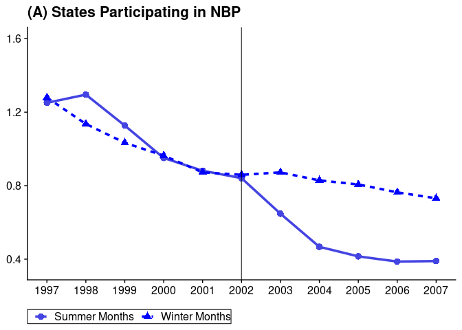
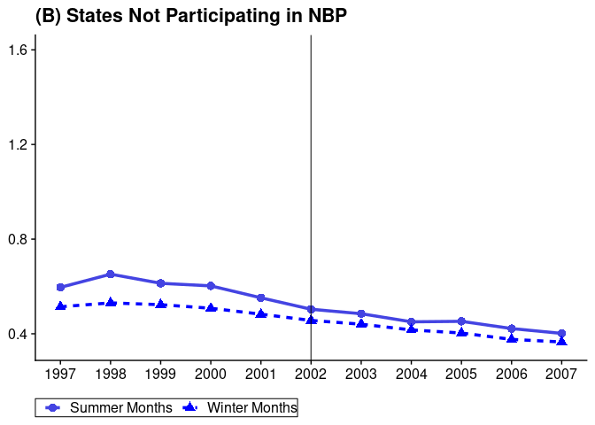

### Question 1

The NBP program was a cap-and-trade system for emissions from generators and industrial boilers in some US states between 2003 and 2008. The goal of the program was the decrease ozone emissions. Since ozone peeks in the summer, the program saw the greatest decrease in emissions during the summer which the analysis shows. 

#### a

If the variable nbp is 1, that means that the state in question was regulated by the $NO_x$ budget trading program. This was a cap-and-trade system to regulate the emissions of nitrogen oxides. 

#### b

If the variable summer is 1, that indicates that the observation occurred during the summer. There is seasonal variation in emissions, which this variable helps to capture. 

#### c

If the variable post is 1, the year the observation was taken was after 2003. 2003 was the year the NBP program went into effect, so this variable captures the cutoff point for the diff-in-diff estimator. 

### Question 2


```r
# Compute the year over year averages for summer

nbp_summer = 
  nbp |> 
  filter(nbp == 1 & summer == 1) |>
  group_by(year) |> 
  summarise(nox_emit = mean(nox_emit),
            summer = "Summer Months") 

# Compute the year over year emissions averages for winter

nbp_winter = 
  nbp |> 
  filter(nbp == 1 & summer == 0) |>
  group_by(year) |> 
  summarise(nox_emit = mean(nox_emit),
            summer = "Winter Months") 

# Combine the data sets

nox_emit_df = bind_rows(nbp_summer, nbp_winter)

# Fix the row types

nox_emit_df %<>% mutate(summer = as.factor(summer))

# Make the graph

nox_emit_df |> 
  ggplot(aes(x = year, y = nox_emit, color = summer, linetype = summer)) + 
  geom_line(size = 1.25) + 
  geom_point(aes(shape = summer), size = 3) + 
  geom_vline(xintercept = 2002, alpha = 0.7) + 
  scale_x_continuous(breaks = scales::breaks_pretty(n = 10)) + 
  scale_color_manual(values = c("#4444e2", "#0000ff")) + 
  ylim(0.35, 1.6) + # To replicate limits in the paper
  labs(x = NULL,
       y = NULL, 
       title = "(A) States Participating in NBP") + 
  cowplot::theme_cowplot() + 
  theme(legend.position = 'bottom',
        legend.box.background = element_rect(color = 'black'),
        legend.title = element_blank())
```

<!-- -->

### Question 3

The parallel trends assumption is that in the absence of the treatment, both groups would have had the same trend. In this case, the treated group are the summer months where the NBP program had its effect. For the parallel trends assumption to hold, we assume that if the NBP program hadn't been instituted in 2002, the summer months would have the same trend in emissions the winter months had. 

Based on the graph, it looks likely that the parallel trends assumption would hold. To see this, we look at the time period before 2002. In that period, the summer and winter months have almost identical trends. It seems unlikely that they would randomly break that trend in the absence of the program. We can never directly test the parallel trends assumption, but in this case it looks likely to hold. 

### Question 4

The diff-in-diff regression we will be estimating is the following:

$NO_x = \beta_0 + \beta_1*Summer + \beta_2*Post + \tau*Summer*Post + \epsilon$ 

In this first diff-in-diff regression, we will limit the data to only states who participated in the NBP program. 


```r
# First we filter to only the states that were under nbp then we can run the regression

nbp_reg = 
  nbp |> 
  filter(nbp == 1) %>%
  lm(nox_emit ~ summer*post,.)

# Report the results

stargazer(nbp_reg, type = 'text', keep.stat = c("N", "rsq"), style = 'qje', dep.var.labels = "NOx Emissions", covariate.labels = c("Summer", "Post", "Summer * Post (τ)"))
```

```
## 
## ========================================================
##                               NOx Emissions             
## --------------------------------------------------------
## Summer                            0.034                 
##                                  (0.054)                
##                                                         
## Post                            -0.223***               
##                                  (0.057)                
##                                                         
## Summer * Post (τ)               -0.373***               
##                                  (0.080)                
##                                                         
## Constant                         1.024***               
##                                  (0.038)                
##                                                         
## N                                 26,070                
## R2                                0.005                 
## ========================================================
## Notes:            ***Significant at the 1 percent level.
##                    **Significant at the 5 percent level.
##                    *Significant at the 10 percent level.
```

This $\tau$ coefficient tells us that after the NBP program began, the gap between $NO_x$ emissions in summer versus winter months was 0.373 lower than before the program began.  

### Question 5


```r
# Compute the year over year averages for summer and no nbp

no_nbp_summer = 
  nbp |> 
  filter(nbp == 0 & summer == 1) |>
  group_by(year) |> 
  summarise(nox_emit = mean(nox_emit),
            summer = "Summer Months") 

# Compute the year over year emissions averages for winter and no nbp

no_nbp_winter = 
  nbp |> 
  filter(nbp == 0 & summer == 0) |>
  group_by(year) |> 
  summarise(nox_emit = mean(nox_emit),
            summer = "Winter Months") 

# Combine the data sets

no_nox_emit_df = bind_rows(no_nbp_summer, no_nbp_winter)

# Make the graph

no_nox_emit_df |> 
  ggplot(aes(x = year, y = nox_emit, color = summer, linetype = summer)) + 
  geom_line(size = 1.25) + 
  geom_point(aes(shape = summer), size = 3) + 
  geom_vline(xintercept = 2002, alpha = 0.7) + 
  scale_x_continuous(breaks = scales::breaks_pretty(n = 10)) + 
  scale_color_manual(values = c("#4444e2", "#0000ff")) + 
  ylim(0.35, 1.6) + # This looks a bit weird, but it keeps consistent axis across both graphs
  labs(x = NULL,
       y = NULL, 
       title = "(B) States Not Participating in NBP") + 
  cowplot::theme_cowplot() + 
  theme(legend.position = 'bottom',
        legend.box.background = element_rect(color = 'black'),
        legend.title = element_blank()) 
```

<!-- -->

### Quesiton 6

The graph above shows the trend in emissions for states not participating in the NBP, and we can see there is no change in the trend in either winter or summer following the introduction of the NBP in 2002. This serves as a placebo test for the parallel trends assumption. Since the trend in the non-participating states stays the same after 2002, we can see that there is not some other factor that caused emissions in the summer to drop in the states that were participating in NBP. The lack of evidence of a change in the non-participating states gives us confidence that the real cause of the drop in emissions in the summer in participating states was due to the program, and not some other random change that happened to happen in 2002. If there was a difference in the trends in the non-participating state, the difference we saw from the participating states would not be useful. We could not tell whether the change in trends was due to the uptake of the NBP program or from just random variation we saw in all the states.

This test is similar to the placebo test we ran in the Huai river analysis. When we see no change in a place we wouldn't expect to see it, it makes the change we do see more interesting, and clear. 

### Question 7

In this second regression, we will estimate the same equation as in question 4:

$NO_x = \beta_0 + \beta_1*Summer + \beta_2*Post + \tau*Summer*Post + \epsilon$ 

This time, we will limit the sample to only the states who didn't participate in the NBP program. 


```r
# Filter to only non nbp states

no_nbp_reg = 
  nbp |> 
  filter(nbp == 0) %>%
  lm(nox_emit ~ summer*post,.)

# Report the results

stargazer(no_nbp_reg, type = 'text', keep.stat = c("N", "rsq"), style = 'qje', dep.var.labels = "NOx Emissions", covariate.labels = c("Summer", "Post", "Summer * Post (τ)"))
```

```
## 
## ========================================================
##                               NOx Emissions             
## --------------------------------------------------------
## Summer                           0.084***               
##                                  (0.033)                
##                                                         
## Post                            -0.102***               
##                                  (0.034)                
##                                                         
## Summer * Post (τ)                 -0.042                
##                                  (0.048)                
##                                                         
## Constant                         0.502***               
##                                  (0.023)                
##                                                         
## N                                 29,788                
## R2                                0.001                 
## ========================================================
## Notes:            ***Significant at the 1 percent level.
##                    **Significant at the 5 percent level.
##                    *Significant at the 10 percent level.
```

This $\tau$ coefficient tells us that after the NBP program began, the gap between $NO_x$ emissions in summer versus winter months was not statistically different than before the program began.  

### Question 8

In this triple difference regression, we will estimate the following equation:

$NO_x = \beta_0 + \beta_1*Summer + \beta_2*Post + beta_3*Treated + \beta_4*Summer*Post + \beta_5*Summer*Treated + \beta_6*Post*Treated + \tau*Summer*Post*Treated$

This regression includes the full data set since this time we are controlling for if a state was in the NBP program or not instead of filtering. 


```r
# Now run the regression but controlling for nbp rather than filtering for it

triple_diff_reg = nbp %>% lm(nox_emit ~ nbp*summer*post,.)

# Report the results

stargazer(triple_diff_reg, type = 'text', keep.stat = c("N", "rsq"), style = 'qje', dep.var.labels = "NOx Emissions", covariate.labels = c("Treated", "Summer", "Post", "Treated * Summer", "Treated * Post", "Summer * Post", "Treated * Summer * Post (τ)"))
```

```
## 
## ==================================================================
##                                         NOx Emissions             
## ------------------------------------------------------------------
## Treated                                    0.522***               
##                                            (0.043)                
##                                                                   
## Summer                                     0.084**                
##                                            (0.042)                
##                                                                   
## Post                                       -0.102**               
##                                            (0.044)                
##                                                                   
## Treated * Summer                            -0.050                
##                                            (0.062)                
##                                                                   
## Treated * Post                             -0.121*                
##                                            (0.065)                
##                                                                   
## Summer * Post                               -0.042                
##                                            (0.062)                
##                                                                   
## Treated * Summer * Post (τ)               -0.331***               
##                                            (0.091)                
##                                                                   
## Constant                                   0.502***               
##                                            (0.030)                
##                                                                   
## N                                           55,858                
## R2                                          0.009                 
## ==================================================================
## Notes:                      ***Significant at the 1 percent level.
##                              **Significant at the 5 percent level.
##                              *Significant at the 10 percent level.
```

The $\tau$ coefficient here is just the difference between the two $\tau$'s from questions 4 and 7. The triple difference estimate is estimating the difference between how the trend changes between the participating and non-participating states which is quite a mouthful to state. Luckily, in question 4, we estimated how the trend changed in participating states, and in question 7 we estimated it for non-participating states. So, the triple difference estimator is just the difference between those.

In question 4, we got that $\tau = -0.373$. In question 7, we got $\tau = -0.042$. $-0.373 - -0.042 = -0.331$, which is exactly what we got in the triple difference regression. 

### Question 9

Based on my analysis, the NBP program was a success, reducing $NO_x$ emissions by 1.865 million tons from 2003 to 2007. I first find that states which participated in the NBP program saw their $NO_x$ emissions significantly in the summer over the winter months. Using a placebo of the states who didn't participate in the program, I show that non-participating states saw no commensurate decrease in their emissions, which strengthens the case for the NBP program causing the decrease in emissions. Finally, I show with a triple difference estimate that there is a statistically significant difference in emissions trends between summer and winter across participating and non-participating states. The triple difference design gives confidence that this estimate is truly causal. I conclude that the NBL program was highly successful in reducing $NO_x$ emissions. 


